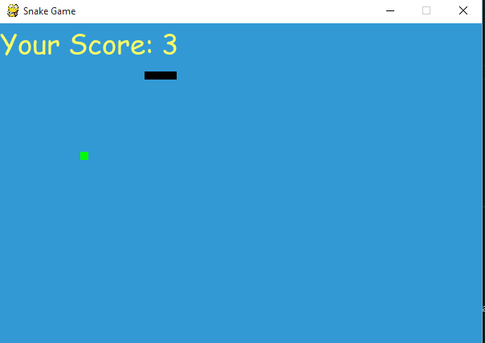

##                                                  PROJECTS
# first project
#   1)    ************ MUSIC PLAYER ***************

Music player software is a type of application software for playing computer audio files. you want to know what is import for making music player then you can know that (tkinter, pygame, and os modules) then easly create this project.

# second Project

#   2)     *********** SNAKE GAME *****************

Snake is the common name for a video game concept where the player maneuvers a line which grows in length
It's used to python of pygame modules and it can easy to implemets this game.

 
