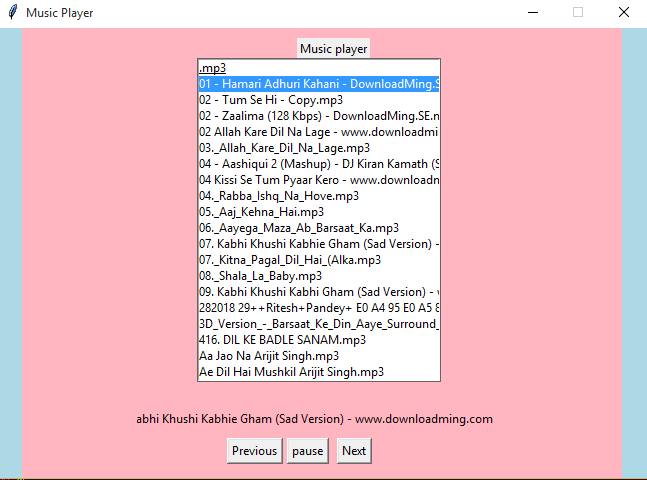
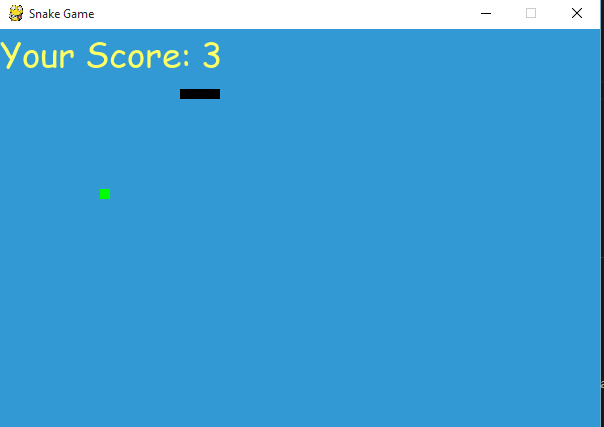
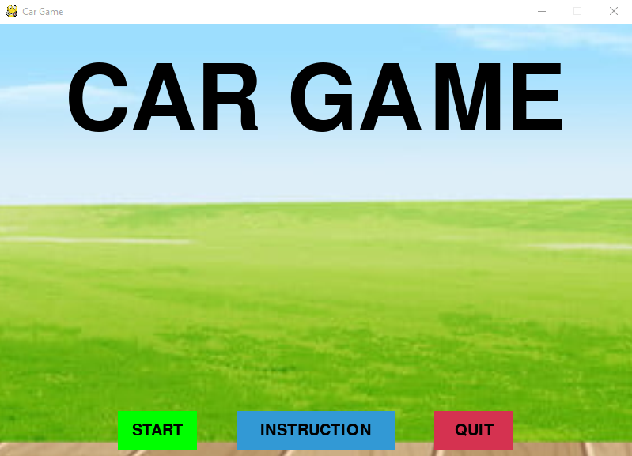
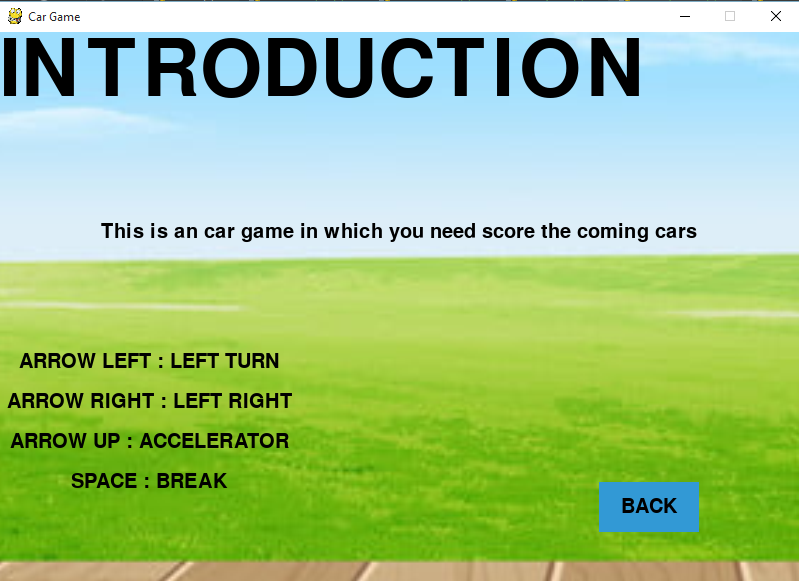
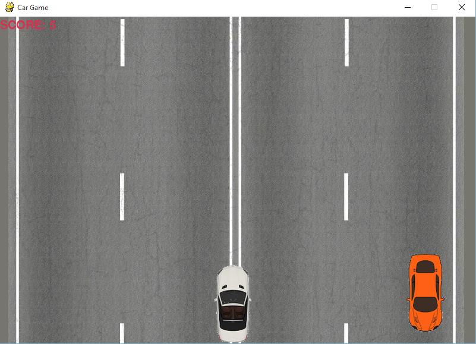

##                                                  PROJECTS

# First project
#   1)    ************ OPENCV  ***************

OpenCV is a huge open-source library for computer vision, machine learning, and image processing. OpenCV supports a wide variety of programming languages like Python

# Secound project
#   2)    ************ MUSIC PLAYER ***************

Music player software is a type of application software for playing computer audio files. you want to know what is import for making music player then you can know that (tkinter, pygame, and os modules) then easly create this project.

# Third Project

#   3)     *********** SNAKE GAME *****************

Snake is the common name for a video game concept where the player maneuvers a line which grows in length
It's used to python of pygame modules and it can easy to implemets this game.

# Fourth Project

#   4)     *********** CAR GAME *****************
For this Car Racing Game, we would like to accomplish a video game imitating the existing game
showed as Figure 1 with a projective view. The theme of our game is to compete with the other 5
opponents that are controlled by computer in a racing tournament, the player’s goal is to get to the
destination as soon as possible while trying to avoid bumping to other cars or road object, the final score
will be posted according to the finishing position, numbers of bumps and the time. 

       First image

       Secound image

       Third image

 
